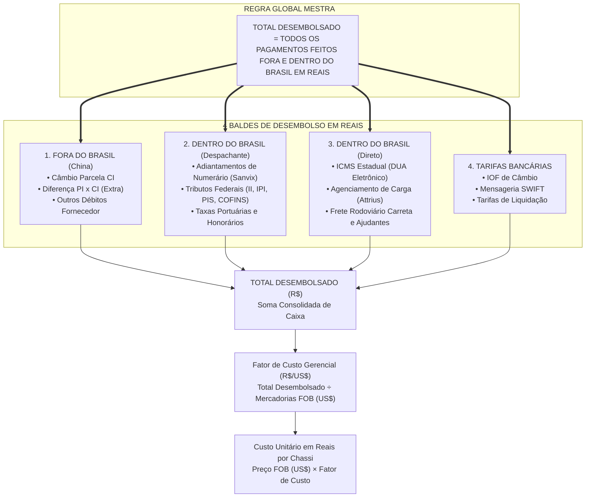
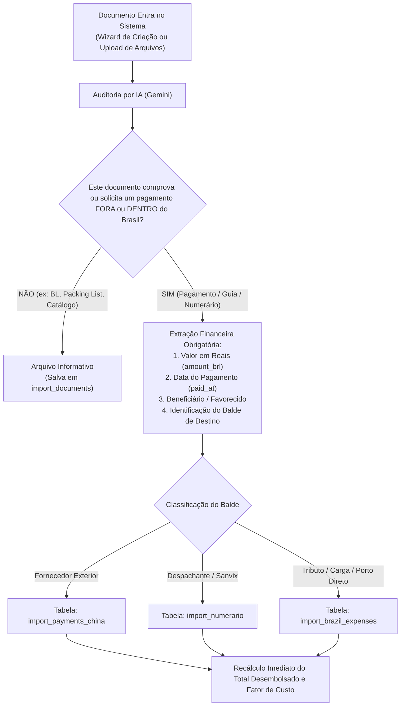

# Documentação Oficial de Cálculo: Total Desembolsado (Líquido Brasil + China)

> **Módulo**: Importações e Desembaraço Aduaneiro (`/imports`)  
> **Indicador Principal**: `Total Desembolsado (R$)` / `total_disbursed_brl`  
> **Subtítulo Visual**: *Líquido Brasil + China*  
> **Arquivo Fonte do Motor de Cálculo**: [`services/import_calculator.py`](file:///Users/macstudio-maj/Documents/Desenvolvimento/Aplicativos/MOne/services/import_calculator.py)  
> **Processo Real de Homologação**: Contêiner `DWSE26070035` (Importação ID 11 — Colvix / MAJ)  
> **Versão da Especificação**: 2.0 (Regra Global Mestra & Protocolo de IA)

---

## 1. A REGRA GLOBAL MESTRA

> ### ⚖️ AXIOMA SOBERANO DO DESEMBOLSO
> $$\mathbf{TOTAL\ DESEMBOLSADO = TODOS\ OS\ PAGAMENTOS\ FEITOS\ FORA\ E\ DENTRO\ DO\ BRASIL\ EM\ REAIS}$$

Esta regra é a **diretriz absoluta, inviolável e prioritária** de toda a sessão de desembolso do M-One:
1. **Abrangência Territorial Total**: Não importa se o pagamento foi feito na China (câmbio em moeda estrangeira convertido) ou no Brasil (tributos federais, ICMS estadual, armazenagem, frete de carreta, honorários, ajudantes). Se houve saída de caixa em prol da importação, **deve compor o Total Desembolsado**.
2. **Moeda Única de Caixa (BRL)**: Todos os desembolsos convergem obrigatoriamente para **Reais (R$)**, utilizando a taxa de câmbio efetiva do contrato de câmbio ou a liquidação bancária.
3. **Métrica-Mãe de Formação de Custo**: O Total Desembolsado é o **numerador único** do *Fator de Custo Gerencial*, determinando o custo contábil exato de cada moto, scooter ou patinete que entra no estoque físico da MAJ.



---

## 2. Diretriz Mandatória para a Inteligência Artificial

> [!IMPORTANT]
> **A análise de Inteligência Artificial DEVE considerar a REGRA GLOBAL MESTRA em TODOS os documentos que entrarem no sistema, sem exceção.**

Nenhum arquivo enviado ao M-One pode ser tratado como mero "anexo estático". Todo documento processado pela IA deve ser submetido ao seguinte **Protocolo de Decisão Financeira**:



### Campos Obrigatórios que a IA Deve Extrair em Todo Documento Financeiro:
1. `is_disbursement` (*booleano*): `true` se o documento comprovar ou solicitar pagamento real.
2. `disbursement_category` (*enum*):
   - `supplier_china`: Remessas e parcelas da compra pagas ao exterior.
   - `numerario_broker`: Adiantamentos ou prestação de contas do despachante aduaneiro.
   - `brazil_direct`: Pagamentos diretos locais (ICMS, terminal, carreta, ajudantes).
   - `bank_fees`: Tarifas e IOF bancário.
3. `amount_brl` (*decimal*): Montante total do desembolso convertido em moeda brasileira (R$).
4. `beneficiary_name` (*texto*): Razão social do recebedor (ex: *SANVIX LOGISTICA LTDA*, *SEFAZ/ES*, *ATTRIUS*).
5. `transaction_id` (*texto*): Código de barras, ID Pix End-to-End ou autenticação bancária.

---

## 3. A Equação Fundamental do Desembolso

$$\mathbf{Total\ Desembolsado\ (R\$) = P_{China} + T_{Banc\acute{a}rias} + D_{Diretas\ BR} + L_{Despachante}}$$

### Decomposição das 4 Parcelas:

| Parcela | Termo Matemático | Origem no Banco de Dados | O que contempla |
| :--- | :---: | :--- | :--- |
| **1. Pagamentos no Exterior** | $\mathbf{P_{China}}$ | `import_payments_china` | Câmbio liquidado da Commercial Invoice (CI) + Pagamentos da diferença da Proforma Invoice (PI) pagos ao fornecedor. |
| **2. Tarifas Bancárias de Câmbio** | $\mathbf{T_{Banc\acute{a}rias}}$ | `import_payments_china.bank_fees_brl` | Custos de fechamento de câmbio, IOF cambial e mensagens SWIFT debitadas pelo banco. |
| **3. Despesas Diretas no Brasil** | $\mathbf{D_{Diretas\ BR}}$ | `import_brazil_expenses` (`payment_mode='direct'`) | Tributos estaduais (ICMS via DUA), faturas de agentes de carga (Attrius), frete de carreta rodoviária, ajudantes de desova. |
| **4. Saldo Líquido do Despachante** | $\mathbf{L_{Despachante}}$ | `import_numerario` | Total adiantado ao despachante aduaneiro (Sanvix) deduzido de eventuais devoluções de saldo (`refund`). |

---

## 4. Glossário Oficial de Documentos Comprobatórios de Desembolso

Cada desembolso exige comprovação documental idônea anexada ao processo:

### 4.1. Solicitação de Numerário Aduaneiro
- **Emissor**: Despachante Aduaneiro (ex.: *SANVIX LOGISTICA LTDA*).
- **Função**: Provisão discriminada dos tributos federais e taxas portuárias para registro da DI/DUIMP:
  * **II, IPI, PIS, COFINS Importação**: Tributos federais alfandegários recolhidos no Siscomex.
  * **Taxa de Utilização do Siscomex**: Tarifa de processamento da Receita Federal.
  * **Marinha Mercante (AFRMM)**: Adicional ao Frete da Marinha Mercante.
  * **Remoção via DTC & Armazenagem EADI**: Trânsito aduaneiro e estadia no porto seco.
  * **SDA, Honorários e Segregação (THC)**: Custos de assessoria e movimentação de contêiner.
- **Regra**: Funciona como documento de provisão/conferência das contas do despachante.

### 4.2. Comprovante de Envio de Transferência de Numerário (PIX / TED)
- **Emissor**: Instituição financeira da empresa (ex.: *Banco XP S.A.*).
- **Função**: **Liquidação e saída efetiva de caixa**. Prova irrevogável de que os recursos solicitados pelo despachante foram efetivamente transferidos da conta da MAJ/Colvix para a conta do despachante.
- **Auditoria**: Contém ID da transação (End-to-End), data, hora e valor (ex: `R$ 187.169,74`). Gera o lançamento de adiantamento (`advance`) em `import_numerario`.

### 4.3. Guia de Arrecadação Estadual — DUA Eletrônico de ICMS
- **Emissor**: Secretaria de Estado da Fazenda (ex.: *SEFAZ/ES*).
- **Função**: Título de obrigação tributária estadual com código de barras de 48 dígitos fixando o valor legal do ICMS Importação a recolher para desembaraço.

### 4.4. Comprovante de Pagamento de DUA Eletrônico
- **Emissor**: Instituição financeira pagadora (ex.: *Banco XP S.A.*).
- **Função**: Comprovação de quitação efetiva do ICMS com autenticação eletrônica bancária, gerando lançamento direto em `import_brazil_expenses`.

---

## 5. Estudo de Caso Oficial: Reconciliação do Contêiner DWSE26070035

O contêiner **DWSE26070035 (Import ID 11)** é o caso oficial de validação das regras financeiras do M-One, demonstrando a transição da apuração parcial inicial para a apuração oficial consolidada.

### Comparativo Consolidado:

```
┌─────────────────────────────────────────────────────────────────────────────┐
│ RECONCILIAÇÃO OFICIAL DE DESEMBOLSO TOTAL — CONTÊINER DWSE26070035          │
├─────────────────────────────────────────────────────────────────────────────┤
│ 1. PAGAMENTOS FORA DO BRASIL (China / Câmbio / Fornecedor):                 │
│    - Câmbio Liquidado Parcela CI (SWIFT USD 48.499,00)    = R$ 248.508,88   │
│    - Diferença PI x CI paga por Fiora                      = R$ 323.114,50   │
│    - Carreta Silotc                                        = R$   1.750,00   │
│    - Ajudantes para descarregamento no CD                  = R$  12.000,00   │
│    Subtotal China / Débitos Diretos                        = R$ 585.373,38   │
│                                                                             │
│ 2. PAGAMENTOS DENTRO DO BRASIL — DIRETOS:                                   │
│    - Agenciamento Marítimo Attrius Cargas (Pix)            = R$   4.984,42   │
│    - ICMS Importação DUA Eletrônico (Banco XP 14/09) [NOVO]= R$  59.210,00   │
│    Subtotal Despesas Diretas Brasil                        = R$  64.194,42   │
│                                                                             │
│ 3. PAGAMENTOS DENTRO DO BRASIL — NUMERÁRIO DESPACHANTE:                     │
│    - Adiantamento Sanvix Logística (Pix XP 11/09)   [NOVO] = R$ 187.169,74   │
│      (Cobrindo II, IPI, PIS, COFINS, Siscomex e taxas)                      │
│    Subtotal Líquido Despachante                            = R$ 187.169,74   │
├─────────────────────────────────────────────────────────────────────────────┤
│ APURAÇÃO ANTERIOR (PARCIAL - SEM OS DOCUMENTOS INCORPORADOS) = R$ 590.357,80│
│ VALOR DOS DOCUMENTOS FALTANTES REGULARIZADOS                 = R$ 246.379,74│
│                                                                             │
│ TOTAL DESEMBOLSADO CONSOLIDADO OFICIAL                       = R$ 836.737,54│
└─────────────────────────────────────────────────────────────────────────────┘
```

---

## 6. Impacto na Formação de Custo e Precificação

Com o Total Desembolsado oficial de **R$ 836.737,54**, o motor recalculou os indicadores de estoque:

### 1. Mercadoria Base (FOB sem Frete Internacional):
$$\mathbf{FOB\ Negociado\ sem\ Frete = US\$\ 102.114,00}$$

### 2. Fator de Custo Gerencial Oficial (R$/US$):
$$\mathbf{Fator\ de\ Custo} = \frac{\text{Total Desembolsado (R\$)}}{\text{FOB Negociado sem Frete (US\$)}} = \frac{836.737,54}{102.114,00} = \mathbf{8{,}1942\ \text{R\$/US\$}}$$

### 3. Custo Unitário por Veículo no Estoque:
Todos os produtos importados na tabela `import_items` e os chassis individuais em `stock_units` passam a ser precificados por:
$$\mathbf{Custo\ Unit\acute{a}rio\ (R\$) = Pre\text{ç}o\ FOB\ Unit\acute{a}rio\ (US\$) \times 8{,}1942}$$

Assim, cada scooter e moto vendida no sistema carrega integralmente a sua fração dos tributos federais da Sanvix, do ICMS capixaba, dos fretes e dos câmbios, blindando a margem de lucro operacional da MAJ Mobilidade.

---

## 7. Requisitos de Implementação para o Motor de IA

Para atender à Regra Global Mestra no código da aplicação, o pipeline de ingestão documental deve seguir os 3 pilares abaixo:

1. **Injeção do Axioma no Prompt do Gemini (`services/import_ai_service.py`)**:
   O prompt deve conter a instrução mandatória:
   > *"REGRA GLOBAL MESTRA: TOTAL DESEMBOLSADO = TODOS OS PAGAMENTOS FEITOS FORA E DENTRO DO BRASIL EM REAIS. Todo documento financeiro deve ser avaliado se comprova desembolso de caixa (fora ou dentro do Brasil), extraindo o valor líquido em Reais (amount_brl), a data e o beneficiário."*

2. **Ativação da IA no Wizard de Criação (`persist_creation_documents`)**:
   Substituir a inserção passiva com `{}` pela extração ativa da IA para todos os arquivos enviados na criação do processo, inserindo automaticamente as linhas em `import_numerario` e `import_brazil_expenses`.

3. **Garantia de Recálculo Automático Instantâneo**:
   Após o upload e persistência de qualquer documento financeiro, o sistema deve acionar automaticamente `calculate_import_financials(import_id, conn)`, atualizando o card *Total Desembolsado*, o *Fator de Custo* e o *Custo Unitário dos Chassis* sem intervenção manual.
