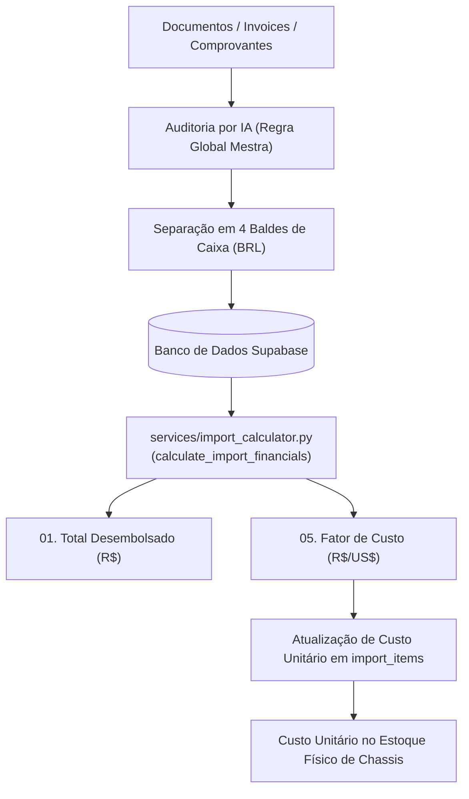

# Manual de Cálculos Financeiros e Aduaneiros — Sessão de Importações (M-One)

Este diretório reúne as especificações técnicas, matemáticas e operacionais de todos os cálculos executados no módulo de importações e desembaraço aduaneiro do **M-One (MAJ Operating System)**.

O objetivo desta documentação é garantir transparência, facilidade de auditoria para a Diretoria e integridade contínua das regras de negócio implementadas no motor [`services/import_calculator.py`](file:///Users/macstudio-maj/Documents/Desenvolvimento/Aplicativos/MOne/services/import_calculator.py).

---

## ⚖️ A Regra Global Mestra de Desembolso

> $$\mathbf{TOTAL\ DESEMBOLSADO = TODOS\ OS\ PAGAMENTOS\ FEITOS\ FORA\ E\ DENTRO\ DO\ BRASIL\ EM\ REAIS}$$
> 
> Esta é a diretriz soberana de toda a sessão financeira de importação. Todo e qualquer documento que entre no sistema (seja via criação de importação ou upload de arquivos) deve ser auditado pela Inteligência Artificial sob esta regra mandatória, convertendo e consolidando todas as saídas de caixa em moeda nacional (R$).

---

## 📚 Índice da Série de Cálculos de Importação

| # | Documento | Indicador / Métrica | Propósito Principal |
| :---: | :--- | :--- | :--- |
| **01** | [**01_TOTAL_DESEMBOLSADO.md**](file:///Users/macstudio-maj/Documents/Desenvolvimento/Aplicativos/MOne/docs/imports/01_TOTAL_DESEMBOLSADO.md) | **Total Desembolsado (R$)** *(Líquido Brasil + China)* | **Regra Global Mestra**, 4 baldes de caixa, protocolo obrigatório de IA, glossário de termos e conciliação real do contêiner `DWSE26070035`. |
| **02** | *02_EQUACAO_PI_CI_EXTRA.md* *(em elaboração)* | **Equação Fundamental da Compra** *(PI = CI + Extra & Dólar Médio)* | Relação entre Proforma, Commercial Invoice alfandegária e Dólar Médio ponderado. |
| **03** | *03_FOB_E_FRETE_MARITIMO.md* *(em elaboração)* | **FOB Negociado & Frete Marítimo** | Separação entre custo puro da mercadoria e frete internacional da transportadora marítima DAWOO. |
| **04** | *04_NUMERARIO_DESPACHANTE.md* *(em elaboração)* | **Numerário Aduaneiro do Despachante** | Adiantamentos, complementos, prestação de contas da Sanvix e blindagem contra dupla contagem. |
| **05** | *05_FATOR_DE_CUSTO_RATEIO.md* *(em elaboração)* | **Fator de Custo Gerencial (R$/US$)** | Multiplicador de formação de custo unitário em Reais por modelo e chassi no estoque físico. |

---

## ⚙️ Arquitetura do Motor de Cálculo e Fluxo Documental da IA

